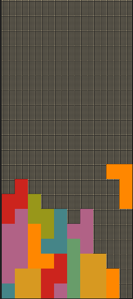

# Terminal Tetris in C


Uses ANSI escape codes to produce colour and Unicode block elements for the pieces and background.
## Controls
Use WASD for movement.
- W (or R) rotates the piece
- A moves the piece to the left
- D moves the piece to the right
- S moves the piece down
## Build & Run

```bash
gcc -o tetris tetris.c && ./tetris
```
